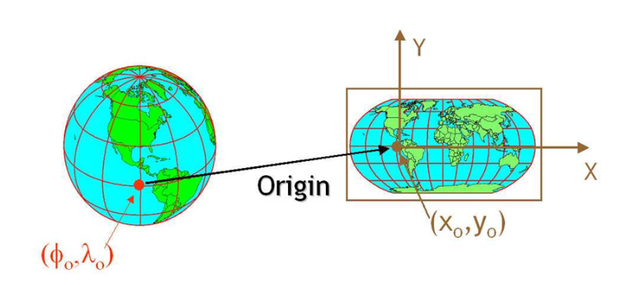

# Spatial Data Visualization

In this chapter, we will learn how to deal with the geospatial dataset with packages ``sf``. We will also interact it with ``ggplot2``. [Link](Spatial_data_visualization_slides/spatial_data_visualization_R.html) for the slides of this lecutre.

## Why spatial visualization with R?

The common solutions for creating maps include several GIS (Geographic Information System) softwares: ArcGIS, QGIS, *etc*. They are powerful in spatial data visualization and analysis. However, they do have some disadvantages, such as the workflow is not easy to reproduce, not good at statistical computing, *etc*. As R has more and more powerful packages that could deal with geospatial data, many researchers and practitioners start to use R in their work. Comparing ArcGIS (or QGIS) with R, is similiar with comparing Stata with R. Both of them have pros and cons. Whether or not you use them depends on your personal perference and task requirements.

Then when we should use R to do spatial data visualization, not ArcGIS? Well, one situation is that you do not have access to ArcGIS (ArcGIS is not free), then R is a good choice for you. Another situation could be that you have used R for your data analysis and then you could continue to use R to do spatial visualization. You do not need to change the working environment in this case. Or if you want to make your work more reproducible, R is a good choice since its codes can be recycled for other similar work and you could check your codes to track your data analysis history.

## Some basics about spatial data

Spatial data has some differences with our common data. The largest one is that it has spatial attributes for indicate locations. Those spatial attributes could be points, lines, or/and ploygon. It could also be the combination of these elements. Points could be the positions for a single-family house, an intersection, a bar, *etc*. Lines could be the segments streets, rivers, *etc*. Polygons could be the boundaries states, counties, cities, *etc*. As shown in the figure below [Source](https://www.earthdatascience.org/courses/earth-analytics/spatial-data-r/intro-vector-data-r/). While they are different spatial attributes, they are all combined with points.


For a spatial data file in R, it is similar to the common dataset. It is a 2-D table with each column for a variable. The spatial data also has a column called ``geometry``. This is the variable indicating the spatial attributes. For example, for a spatial file including the points of several cities in Minnesota. Its geometry column will be the longitudes and latitudes of those points. If a spatial file contains the boundaries of the states in the U.S., then its geometry column will be the locations of the polygons. If a sptial data has the information of points, it is called point spatial data. If a spatial data has the information of lines, it is called line spatial data. If a spatial data has the information of polygons, it is called polygon data. A spatial data file can only include one type of spatial attribute.


For all geospatial varialbes, they should have a very important information called coordinate reference system (CRS). We will not expand the concept in this lecture. The simple idea is that it is the system to locate geographical entities. For example, you could use longitude and latitude to locate the position of everything on earth, which is a 3D sphere. Or you could use another type of CRS to locate the position of something in a 2D flattened map, as shown in the figure below ([Source](https://www.earthdatascience.org/courses/earth-analytics/spatial-data-r/intro-to-coordinate-reference-systems/)). For the a same position, its indices will be different in different CRSs. There are two formats of CRS. One is ``EPSG`` and the other is ``proj4string``. ``EPSG`` is a conbination of numbers. ``proj4string`` contains variables and values. You could find more information about them in this [link](https://spatialreference.org/).



After reviewing some concepts for geospatial data. Let's write some codes in R.

Before start, let's install the package first.

```{r eval=F}
install.packages('sf')
```

And import the package.

```{r}
library(sf)
```

## Read files

To answer the question, we should firstly import the map of the Twin Cities metro area.

With ``sf``, we could read the shapefile by ``st_read()`` function. The dataset is from the [Minnesota Geospatial Commons](https://gisdata.mn.gov/dataset/us-mn-state-metc-society-census2010realign). It contains the geospatial information of the census tracts of the Twin Cities metro area.

```{r}
map <- st_read('Census2010RealignTract.shp')
```

After running the codes, the console has shown some information about the shapefile we just read.

```{r}
class(map)
```

With ``class()``, we could check the type of the variable. It is both ``sf`` and ``data.frame``. ``sf`` means the dataset is a type of geospatial data and contains some related information. ``data.frame`` means that the dataset is also a data frame and could be managed by many functions working on data frames.

```{r}
head(map)
```

With ``head()``, we could see that there is a column called ``geometry``. Every ``sf`` file will have this column, where stores the geospatial information of the observations. Other columns are just normal columns containing information for the observations.

We could use ``st_crs()`` to check the CRS of the variable.

```{r}
st_crs(map)
```

Luckily, this variable contains the right CRS. For the maps in the area of Minnesota, the CRS is the one showing above, 26915 for ``EPSG``.

However, sometimes, the file does not have CRS information. You have to check the original source of the file and assign the right CRS to it.

```{r}
st_crs(map) <- 26915
```

By doing this, there is a message telling that this function will not do the transformation for us. Sometimes, even if the file contains the right CRS, its CRS might be different from other files. **If you want to map them in the same page or want to do geospatial data analysis among them, you have to transfer the CRSs of them to the same one. You could do this by using ``st_transform()``.**

We could use ``ggplot2`` to visualize the map. For simply mapping the polygons, we do not need to speficify ``aes()``. And we use ``geom_sf()`` to plot map.

```{r}
library(ggplot2)

ggplot(map) +
  geom_sf()
```


## Deal with spatial data like data frame

As the spatial data is also a data frame in R. We could use ``dplyr`` to deal with it. For example, select the column we want.

The current spatial data ``map`` contains some variables we do not need, so we could select the useful ones by using ``select()`` function in ``dplyr``. Please pay attention that we do not need to select the geometry column. It will be selected automatically. In this lecture, we only select GEOID, which is the ID for each area/tract.

```{r message = F}
library(dplyr)
new_map <- map %>%
  select(GEOID)
```

To answer the question, we still need more information. We need the old population and total population for each census tract in the Twin Cities metro area to compute the percentage of old population.

We could join other data to the current geospatial variable by the join functions in ``dplyr``. Firstly, we import the data.

```{r}
library(readr)
data <- read_csv('data.csv')
```

This dataset also has a variable called GEOID, which could be used to do the join operation. The list below presents the descriptions of other variables, which are all from 2012-2016 five-year ACS estimates.

| Variable   | Descriptions                                        |
|------------|-----------------------------------------------------|
| GEOID      | Unique identifier used by Census FactFinder website |
| POPTOTAL   | Total population                                    |
| HHTOTAL    | Total households                                    |
| AGEUNDER18 | Population age under 18                             |
| AGE18_39   | Population in this range                            |
| AGE40_64   | Population in this range                            |
| AGE65UP    | Populationage 65+                                   |

```{r}
class(new_map$GEOID)
class(data$GEOID)
```

We could join this data to the map by using the GEOID column. Before join operation, we have to transfer the GEOID to match the data type of GEOID in the map file. Currently, their types are different, one is factor and other is numeric. They have to be the same data type before joining.

```{r}
data <- data %>%
  mutate(GEOID = factor(GEOID))
```

Then, we do the join operation.

```{r}
new_map <- new_map %>%
  left_join(data, by = 'GEOID')
```

This message tells us that the levels of factors in the GEOIDs of the two files are different. This makes sense, since the data file has more observations, which also will have more levels.

## Data management

We calculate the percentage of old people in each census tract.

```{r}
new_map <- new_map %>%
  mutate(old_percent = AGE65UP/POPTOTAL)
```

## Spatial data visualization

We could use ``ggplot2`` by its ``geom_sf()`` function.

```{r message=F}
p <- ggplot(new_map, aes(fill = old_percent)) + # use fill to indicate the variable you want to visualize
  geom_sf()
p
```

The color is not good, we could add ``scale_fill_gradient()`` to specify the colours we want.

```{r}
p + scale_fill_gradient(low = 'white', high = 'red')
```

Again, we could add more information to make the figure better and more readable, and change the theme a little bit.

```{r}
p + scale_fill_gradient(low = 'white', high = 'red') +
  labs(title = 'Distribution of old population in the Twin Cities area',
       fill = 'Percentage') +
  theme_bw()
```

Finally, we could use ``ggsave()`` to save the plot we want after we run the ``ggplot()`` function.

```{r eval=F, echo=F}
ggsave('fig1.jpg', width = 10, height = 10)
```


## More example

We could visualize the population directly in the map with ``ggplot2``.

```{r}
ggplot(new_map, aes(fill = POPTOTAL)) +
  geom_sf(colour = 'White') +
  scale_fill_gradient(low = 'white', high = 'Orange') +
  labs(title = 'Distribution of population in the Twin Cities area',
       fill = 'Population') +
  theme_bw()
```

## Geospatial data analysis

For those who are familiar with geospatial operations in ArcGIS, ``sf`` also provides functions to do geospatial data analysis, such as spatial join, intersect, clip, *etc*. For example, you could use ``st_join()`` to carry out spatial join, use ``st_intersects()`` to do intersect, and ``st_intersection()`` to do clip. You could find more [here](https://r-spatial.github.io/sf/index.html).


