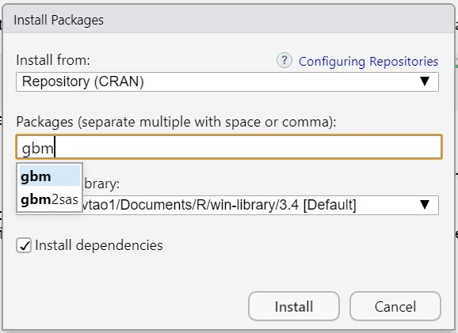

--- 
title: "PA 5928 Data Management & Visualization with R (Updating)"
author: "Tao Tao (University of Minnesota)"
date: "`r Sys.Date()`"
site: bookdown::bookdown_site
documentclass: book
bibliography: [book.bib, packages.bib]
biblio-style: apalike
link-citations: yes
description: "This is the website for couse PA 5928 in the University of Minnesota"
---

# Course Syllabus

## Course Description

Introduction to ``RStudio`` software. Use of ``RStudio`` to carry out ``R`` file and related dataset management functions. Tools and techniques for data analysis and statistical programming in quantitative research or related applied areas. Topics include data selection, data manipulation, and data visualization (including charts, plots, histograms, maps, and other graphs).

## Course Prerequisites

Introductory statistics (regression is not necessary); ability to create bar graphs, line graphs, and scatter plots in MS Excel; and familiarity with principles of data visualization.

## Logistics

Instructor: Tao Tao, taotao@umn.edu  
Location: HHH 85  
Time: Starting 10/8: Tuesdays 9:45AM to 11:00AM   
Office hours: Tuesday from 2:00 pm to 4:00 pm at HHH 271  
Canvas: All course notes will be posted in this course website, but links will be provided on ``Canvas``. ``Canvas`` will also be used to submit your in-class exercises, final project, and grades.  So you only need to pay attention to ``Canvas`` to check everything!

## Course Learning Outcomes

At the end of this course, students will be able to:

1. Use RStudio to carry out R file and related dataset management
2. Use R to work with different types of datasets and conduct basic data management
3. Use R to visualize data with different types of plots

## In-class exercise and final project

1. An in-class exercise will be assigned during each class for the students to practice what they have learned. [ChimeIn](https://chimein2.cla.umn.edu) will be used in class to check the class performance in a anonymous way.
2. The in-class exercises will be mostly finished during the class time, and students are still required to submit their codes on the same day with necessary notes to indicate their ideas.
3. Students will use the knowledge from this course to complete a final project (data analysis for a interested research question and write a short report about it).
4. Grading policy

* In-class exercise codes: 60%
* Final project: 40%

## Course Schedule (Tentative)


| #  | Date  | Topic                               | Notes |
|----|-------|-------------------------------------|-------|
| 1  | 10/8  | Introduction to ``RStudio``            |Uploaded |
| 2  | 10/15 | Introduction to ``R``                   |Uploaded |
| 3  | 10/22 | Data manipulation with base functions    |Uploaded |
| 4  | 10/29 | Data manipulation with ``dplyr``   |Uploaded |
| 5  | 11/5  | Data visualization with base functions  |       |
| 6  | 11/12 | Data visualization with ``ggplot2`` |       |
| 7  | 11/19 | R Statistics (I)                    |       |
| 8  | 11/26 | R Statistics (II)                   |       |
| 9  | 12/3  | Spatial visualization (I)           |       |
| 10 | 12/10 | Spatial visualization (II)          |       |

## Homework and projects collaboration and submission policy

1. **Students can discuss their works with other students, but must code and write up notes by themselves. [Plagiarism](https://communitystandards.umn.edu/content/plagiarism) is not allowed by the university policies. Please do be careful about this.**
2. In-class exercises and projects should be submitted through **Canvas**. If you cannot attend the class, please write a email to the instuctor including a valid reason before the class. Then you can make up the in-class exercise in the following one week after the class.
3. When you communicate the instructor with emails, please include ``PA 5928`` at the beginning of your title.

## Some results from the online survey

### Question 1

```{r echo = F, warning =  F, message = FALSE}
library(readr)
survey<- read_csv("survey_results.csv", na = "empty")

library(ggplot2)
ggplot(survey, aes(x = Q2)) +
  geom_bar() +
  coord_flip() +
  scale_x_discrete(name ="Are you a?", 
                   limits=c('1st Y Master', '2 nd Y Master', '3rd Y Master', 'PhD'))
```

### Question 2

```{r echo = F, warning =  F, message = FALSE}
survey[is.na(survey)] <- 0
sum <- c(sum(survey$Q3_1), sum(survey$Q3_2), sum(survey$Q3_3), sum(survey$Q3_4), sum(survey$Q3_5), sum(survey$Q3_6))
option <- c('Mean, median, and mode', 'Quantile', 'Simple linear regression', 'Multi-variable regression', 'Logistic regression', 'None of them')
df <- data.frame('Q3' = option, 'count' = sum)
ggplot(df, aes(x = Q3, y = count)) +
  geom_col() +
  coord_flip() +
  scale_x_discrete(name = 'Which part should be reviewed in class?', limits=df$Q3)

```

### Question 3

```{r echo = F, warning =  F, message = FALSE}
# Load
library("tm")
library("SnowballC")
library("wordcloud")
library("RColorBrewer")

text <- readLines('survey_result.txt')
docs <- Corpus(VectorSource(text))

docs <- tm_map(docs, content_transformer(tolower))
docs <- tm_map(docs, removePunctuation)
docs <- tm_map(docs, removeWords, stopwords("english"))

dtm <- TermDocumentMatrix(docs)
m <- as.matrix(dtm)
v <- sort(rowSums(m),decreasing=TRUE)
d <- data.frame(word = names(v),freq=v)

set.seed(5928)
wordcloud(words = d$word, freq = d$freq, min.freq = 1,
          max.words=100, random.order=FALSE, rot.per=0.35, 
          colors=brewer.pal(8, "Dark2"))
```

<!--chapter:end:index.Rmd-->


# Introduction to RStudio

In this chapter, we will go through some basic operations of RStudio.

## What is R
**R** is a type of programming language and supports many tasks including statistical computation (data cleaning, data management, [statistics](https://r-statistics.co/Linear-Regression.html), [machine learning](https://vtao1989.github.io/DisToTransit_statistics/)) and graphics ([static plots](http://r-statistics.co/Top50-Ggplot2-Visualizations-MasterList-R-Code.html) and [interactive plots](https://plot.ly/r/3d-surface-plots/)). You can also use it to create website (like this course website), write papers, analyze texts, *etc*. The most important thing is that **R is free and easy to use**, that's why it has been applied in many fileds.

## What is RStudio
**RStudio** is a programming software for editing and running R code. It has many great features to make R programming easier!

## Install R + RStudio
For better coding and running R, you should install both R and RStudio. You could code R with the installation of R only, however, RStudio provides you with more conveinece in coding. In this course, we will use RStudio to do all the course lectures and exercises. So please make sure you install both of them!  
R could be downloaded [here](https://www.r-project.org/) and RStudio could be downloaded [here](https://www.rstudio.com/products/rstudio/download/). Both Windows OS (Operating System) and Mac OS are supported, so please choose the right one you need for your own system. (If you have any questions about the installation of R or RStudio, please come to me in the office hours or ask [IT](https://it.umn.edu/) for help)  
Or you could use the computers in the lab when there is no lecture.

## Familiar with the user interface of RStudio
Below is a screenshot of the user interface of RStudio. You will find couple of panes/windows with different usages.[@Selvam2019]

1. **Menu/Tool Bar**
2. **Source**  The pane where you write and edit your codes.
3. **Environment/History** Environment lists all the variables that you are currently using. History presents the codes you have runned before.
4. **Console** Console is the original R interactive window. You could run codes and see the results here.
5. **Plot/Help** Plot window shows the output figures. Help window presents the information of the function or package you are checking.


## Create and save R file
Three ways to create a R file in the RStudio:
```
1. Menu -> File -> New File -> R Script
2. Shortcut: Ctrl + Shift + N
3. Tool Bar -> New file button
```

Also three ways to save R file
```
1. Menu -> File -> Save
2. Shortcut: Ctrl + S
3. Tool Bar -> Save file button
```

## Print Hello, world
Now, let's try to code something and run them! Let's print the very classic "Hello, world!" with ``print()`` function.  
We could run the codes in several ways:

1. Select the codes or put the cursor in the line of your code, and click the Run button located in the right-top position of the ``source`` pane.
2. Select the codes or put the cursor in the line of your code, and use shortcut: Ctrl + Enter
3. You could also click the Re-run button near the Run button to re-run the codes you ran last time.

```{r}
print('Hello, world!')
```

Because what we need to output here is a **string varible**, we have to put them in the quotation mark. Either single quotation or double quotation mark works well. Let's see another example.

```{r}
print(5928)
```

Here, 5928 is an integer and we do not need to put them in the quotation marks.

## Install and use R Packages
R is easy to use because it has many packages with different usages. These packages could help you accomplish some complex tasks with just several lines of codes.  
Some packages have been already been installed and you could use them directly, which are ``base packages``. However, most of the packages have to be installed before you use them. There are couple of ways you could install a package. Let's take the ``gbm`` package for example.
```
1. Manu -> Tools -> Install Packages... -> Input the package name -> Click Install button
```
<center>
{ width=35% }
</center>

```
2. Use the code below:
install.packages("gbm")
```

After the installation of the package, you have import it with ``library()`` function before you use the related functions.
```{r}
library(gbm)
```

We will spend more time in future classes to explore the various R packages and their different usages.

## Make notes
It is important to write notes for your codes. It could help others or even yourself understand your codes easily. Use hash tag to indicate the notes. For example,
```{r, eval=FALSE}
gbm1 <- gbm(AvgMet~PkAreaH+StpNumH+DisToMin,  # formula
            data=MetM,                        # dataset  
            var.monotone=c(+1, rep(0,10),rep(0,15)), 
            distribution="gaussian",          # see the help for other choices  
            n.trees=5000,                     # number of trees  
            shrinkage=0.001,                  # shrinkage or learning rate, 0.001 to 0.1 usually work  
            interaction.depth=6,              # 1: additive model, 2: two-way interactions, etc.  
            bag.fraction = 0.5,               # subsampling fraction, 0.5 is probably best  
            n.minobsinnode = 10,              # minimum total weight needed in each node
            cv.folds = 5)
```
R will not run the codes after hash tags in each line.

Please try to write simple but necessary notes for the codes. Keep this as a good habbit and you will thank yourself in the future.

## Tips
1. You could divide your codes into sections by enterting chunks before each sections with the shortcut: Ctrl + Shift + R. This will help you organize your codes.
2. Use ``?`` or ``help()`` function to find the related instruction or help page, for example, if you want to find the instruction of ``library()`` function, just code
```
?library
```
or
```
help(library)
```
Both will direct you to the instruction page you are looking for in the help window.


<!--chapter:end:01-Introduction_to_R_Studio.Rmd-->

# Introduction to R

A variable is used to store data including value, vector, data frame, *etc*, which ``R`` could use to manipulate [@tutorialspoint2]. This chapter introduces variable types, operations between variables, data structures, conditional statements, loops, and functions.

Before we start, let's first see how to name a variable. The valid variable name could be constructed with letters, numbers, the dot character (``.``), and underline character (``_``). Besides that, a valid variable name should start with a letter or the dot charater not followed by a number.

| Examples   | Validity | Discussion                                                                |
|------------|----------|---------------------------------------------------------------------------|
| var.name   | ✓        |                                                                           |
| var_name   | ✓        |                                                                           |
| _var_name  | ☓        | Cannot start with the underline                                           |
| .var_name  | ✓        |                                                                           |
| var%name   | ☓        | Cannot contain %                                                          |
| .2var_name | ☓        | Cannot use the dot followed by a number to start with a variable name  |
| 2var_name  | ☓        | Cannot start with a number                                                |

## Variable types 
There are several types of variables which R could recognise, including character, numeric, integer, logical, and complex [@Blischak2019]. The type of one variable is decided by the type of value it stores. We can use ``class()`` function to check the type of each variable.

**Character** (also known as strings)

```{r}
v <- "Hello, world!"
class(v)
```

**Numeric** (real or decimal number/integer)
```{r}
v <- 59.28
class(v)
```

**Integer** (``L`` tells R that this number is an integer)
```{r}
v <- 2L
class(v)
v <-2
class(v)
```

**Logical** (Usually True or false)
```{r}
v <- TRUE
class(v)
v <- FALSE
class(v)
```

**Complex** (complex number is another type of number, different with real number)
```{r}
v <- 1 + 4i
class(v)
```

It is important to know clearly what is the type of the variable you are using since different types of variables may have different methods to deal with. Another caveat is that the outlook of the variable may not show its real variable type. For example, a common situation is that a variable contains numbers could be characters.

```{r}
v <- "59.28"
class(v)
```

Here, the number has quotation marks outside, which means it has been transferred to type character. **Therefore, please be careful about this!**

## Operations

An operation tells ``R`` the mathematical or logical munipulations [@tutorialspoint2019].

### Assignment operations

Assignment operators assign values to variables.

**Left assignment**
```{r}
a <- 1
b <<- "Hello, world!"
c = c(1, 3, 4)
```

**Right assignment**
```{r}
1 -> a
2 ->> b
```

### Arithmetic operations

**Add**
```{r}
1 + 1
```

**Subtract**
```{r}
5 - 3
```

**Multiple**
```{r}
3 * 5
```

**Divide**
```{r}
5 - 3
```

**Power**
```{r}
5 ^ 2
5 ** 2 # you can also do like this
```

**Mode** (find the remainder)
```{r}
5 %% 2
```

### Relational operations

The relational operators compare the two elements and return a logical value (``TRUE`` or ``FALSE``)

**Larger**
```{r}
3 > 4
5 > 3
```

**Smaller**
```{r}
3 < 5
4 < 2
```

**Equal**
```{r}
4 == 4
5 == 4
```

**No less than** (larger or equal to)
```{r}
3 >= 4
3 >= 2
```

**No larger than** (samller or equal to)
```{r}
5 <= 2
5 <= 5
```

**Not equal**
```{r}
3 != 4
3 != 3
```

### Logical operations

Logical operators are operations only for logical, numeric, or complex types. Most of the time, we apply them on logical values or variables. For numeric variables, 0 is considered ``FALSE`` and non-zero numbers are taken as ``TRUE`` [@DM2019]. You could use ``T`` for ``TRUE`` or ``F`` for ``FALSE`` as abbreviation.

**Logical And**
```{r}
TRUE & TRUE
FALSE & TRUE
FALSE & FALSE
```

**Logical Or**
```{r}
TRUE | TRUE
FALSE | TRUE
FALSE | FALSE
```

**Logical Not**
```{r}
! TRUE
! FALSE
```

## Data structures

Variables and values could construct different data structures including vector, matrix, data frame, list, and factor [@Kabacoff2019].

**Vetor**

You could create a vetor with ``c()`` function.

```{r}
a <- c(5, 9, 2, 8) # create a numeric vector
a # show the value of this vetor
```

```{r}
b <- c('hello', 'world', '!') # character vector
b
```

```{r}
c <- c(5, 'good') # if you create a vector containing mixed variable types, such as numeric and character, R will restrict them to be the same variable type, here, character
c
```

You could select elements in the vetor by using ``var_name[#]``. Please pay attention on how ``R`` indexes its elements in the data structure.

```{r}
a[3] # select the 3rd element
b[1:3] # select from the 1st to the 3rd element
c[1] # select the 2nd element
```

``1:3`` means from 1 to 3, so it actually stands for three numbers here, which are 1, 2, 3.

**Matrix**

You could create a matrix using ``matrix()`` function.

```{r}
a <- matrix(1:6,      # the data to be put in the matrix, here we use numbers from 1 to 6
            nrow = 2, # number of rows in the matrix
            ncol = 3, # number of columns in the matrix
            byrow = FALSE) # how to put the data in the matrix, FALSE means by columns, TURE means by rows.
a
```

For variable selection, the intuitive way is using coordinates.

```{r}
a[2,3] # select the elements in the 2nd row and 3rd column
```

You could also select the entire row or column.

```{r}
a[ ,2] # the 2nd column
a[1, ] # the 1st row
```

**Data frame**

Data frame is a **frequently-used** data type in R. It could include columns with different types of values stored in them. Let's create a dataframe with mixed variables types using ``data.frame()`` function.

```{r}
ID <- c(1:4) # create variable ID
Name <- c('A', 'B', 'C', 'D') # create variable Name
Score <- c(69.5, 77.5, 81.5, 90) # create variable Score
df <- data.frame(ID, Name, Score) # combine the varibles into one data frame called df
df
```

We created a data frame stored the students' ID, name, and their test scores. If we want to select elements from this data frame, there are couple of ways.

```{r}
df[2,3] # 2nd row and 3rd column
df['ID'] # column of variable ID
df[c('ID', 'Score')] # column of ID and Score
```

There is another way to select the column by its name. When you type ``$`` after the name of the data frame, RStudio will list all the variable names in that data frame which makes it easier to choose the variable you want. It is more commonly used.

```{r}
df$Name # column of variable Name
```

**List**

A list could store mixed types of values, which is different from vetor.

```{r}
a <- list(ID = c(1, 2), Name = c('A', 'B'), Score = c(69.5, 89))
```

When you want to select elements from a list, you could do it in a similar way as a vector. However, list does not define row or column, so you cannot use 2-D coordinates to select elements like a data frame.

```{r}
a[1]
a[2:3]
```

Someone might be confusing since list looks silimar to data frame. [Here](https://stackoverflow.com/questions/15901224/what-is-difference-between-dataframe-and-list-in-r) is a good discussion about it. Due to the time limitation, we will not cover this discussion in class. The main idea is that list is more flexible than data frame, while data frame has more restrictions. However, since data frame is more similar to 2-D table structure which is more frequently used in our daily work. We apply data frame more than list.

**Factor**

Factor is the nominal variable in R. This type will be very useful when we want to analyze data from different groups, such as gender, school, *etc*.

```{r}
a <- c(1, 2, 1, 2, 3, 3, 1, 1)
class(a)
```

```{r}
afactor <- factor(a)
class(afactor)
```

## Conditional statements

```{r, eval=FALSE}
if (test_expression){
  statement_1
} else {
  statement_2
}
```

If the ``test_expression`` returns ``TRUE``, then the codes will go to ``statement_1``, if it returns ``FALSE``, the codes will go to ``statement_2``. You could also omit the ``else`` part.

```{r, eval=FALSE}
if (test_expression){
  statement_1
}
```

If the ``test_expression`` returns ``FALSE``, the codes will continue to next line.

```{r}
x <- 5
if (x > 3){
  print('x is larger than 3')
} else {
  print('x is not larger than 3')
}
```

```{r}
x <- 1
if (x > 3){
  print('x is larger than 3')
} 
```

Some other conditional statements include ``switch``, ``which``, *etc*.

## Loops

Loops help us repeat the codes we want to run in more than one times. ``for`` loop is the intuitive and commonly-used one.

```{r, eval=FALSE}
for (range){
  statement
}
```

``range`` will provide the range for a variable.

```{r}
for (i in 1:3){
  print(i)
}
```

## Functions

Functions are codes have been defined with specific usage. You only need to input some necessary variables and functions will do the tasks and return the result. For example, ``sum()`` function could help you add the all the numbers in a vector or dataframe and return the sum.

```{r}
sum(c(1, 4, 10, 5))
```

Another example is ``mean()`` function could help you average the numbers in a vector or data frame and return the mean value.

```{r}
mean(c(1, 4, 10, 5))
```

It is important to use the right function to do the right task. To do this, you have to be familiar with the functions you are using. It needs more practice.

<!--chapter:end:02-Introduction_to_R.Rmd-->

# Data Manipulation with Base Functions

We will introduce how to manipulate with different datasets using base functions in R.

## Import and save datasets

There couple of ways to importing and saving different types of datasets [@quickr1;@quickr2].

### Import data

**CSV file**
```{r, eval=FALSE}
mydata <- read.csv('c:/mydata.csv', # file location and name
                   header = TRUE, # read the first 
                   sep = ",") # which type of separation
```

**EXCEL file**
```{r, eval=FALSE}
library(readxl)
dataset <- read_excel('c:/mydata.xlsx', # file location and name
                      sheet = 'data') # name or index of the sheet
```

**dta STATA file**
```{r, eval=FALSE}
library(foreign)
mydata <- read.dta('c:/mydata.dta') # file location and name
```

Here is an easy way to load dataset in RStudio.

**System tool**
Besides importing data by codes, you could also import data with the system tool. If this is your first time to use this tool, there may be a process to install the packages depending your options. But don't worry, RStudio can do it by itself. You just need to click the button to approve the installation.

```
File -> Import dataset -> choose the type of dataset you want to import
```
There are some other options or parameters you could set in the import functions listed above (e.g., specify a variable type or try to skip some of the rows). Sometimes it is sort of complex to do it. So for me, I just do those things after I import the dataset.

### Save file
**CSV file**
```{r, eval=FALSE}
write.csv(df, # data
          'c:/filename.csv') # file location and name
```

**EXCEL file**
```{r, eval=FALSE}
library(xlsx)
write.xlsx(mydata, # data
           "c:/mydata.xlsx") # file location and name
```

**dta STATA file**
```{r, eval=FALSE}
library(foreign)
write.dta(mydata, "c:/mydata.dta")
```

Usually, it takes less time to save file in CSV and CSV file has a smaller size in storage.

### File location

As you can see in the examples, you need to specify the location (or path) of the file to make sure that R could find your file in the right position. Usually you could find it by checking the system property of the file.

You could aovid this. First put your R file and dataset in the same folder. Then start the R file by double clicking. R will use the folder where the R file locates as the working folder. Then you could only specify the name of the file.

This is recommended. Since it will easier for others to check your codes since they do not need to change the path of the file.

## View data

You could view the variable names and simple discription in the ``Environment`` pane on the right-top position of RStudio. If you want to view more information, clik the variable name and view the variale in new window. Here, we use the built-in dataset ``mtcars`` as a example. By importing this dataset, use ``data()`` function.

```{r}
data(mtcars)
```

You could also view the data in the new window by ``View()`` function. Please pay attention that it is initial-capitalized.

```{r, eval=FALSE}
View(mtcars)
```

View the first ten observations (rows) in the dataset. <dbl> stands for double class, which is a subtype of numerical variable type.
```{r}
head(mtcars, n = 10)
```

view the last five observations in the dataset.

```{r}
tail(mtcars, n = 5)
```


List the variables in the dataset [@quickr3].
```{r}
names(mtcars)
colnames(mtcars)
```

List the structure of the dataset.
```{r}
str(mtcars)
```

List the dimentions of the dataset
```{r}
dim(mtcars)
```

List the number of rows in the dataset
```{r}
nrow(mtcars)
```

List the number of columns in the dataset.
```{r}
ncol(mtcars)
```

## Data selection
Select one column with 5 rows of observations.
```{r}
head(mtcars$mpg, n = 5) # by name
head(mtcars[1], n = 5) # by index
```

Select several columns with 5 rows of observations.
```{r}
head(mtcars[c('mpg', 'disp')], n = 5) # by name
head(mtcars[c(1, 3, 5)], n = 5) # by index
```

Select one row by index
```{r}
mtcars[1,] # by index number
mtcars['Valiant',] # by name of the index
```

Select several rows
```{r}
mtcars[2:3, ] # by index
mtcars[c(1,5,9), ] # by index
mtcars[c('Valiant', 'Hornet Sportabout'), ] # by name
```

## Conditional selection

```{r}
mtcars[mtcars$mpg > 25, ]
```
```{r}
mtcars[(mtcars$mpg > 25) & (mtcars$qsec < 19), ]
```
```{r}
mtcars$mpg[mtcars$gear == 4]
```

When you do it like this, you select elements from a vector, you do not need to use comma here.

## Deal with missing values
In R, the missing values is presented as ``NA``.

Test the existence of missing values with ``is.na()`` function. We use an revised old example here.

```{r}
ID <- c(1:4) # create variable ID
Name <- c('A', NA, 'C', 'D') # create variable Name
Score <- c(69.5, 77.5, NA, 90) # create variable Score
df <- data.frame(ID, Name, Score) # combine the varibles into one data frame called df
is.na(df)
```

Assign missing values
```{r}
df$Score[df$Score == 90] <- NA
df
```

NAs will influence some functions.
```{r}
mean(df$Score) # get the mean value (does not ignore NA)
mean(df$Score, na.rm=TRUE) # (ignore NA)
```

Test if the observations in the dataset has NAs.
```{r}
complete.cases(df)
```

Find the observations with no NAs.
```{r}
na.omit(df)
```

## Subset

``subset()`` is another way to select the data you want.

Select observations with ``mpg`` larger than 30.
```{r}
data(mtcars)
newdata <- subset(mtcars, mpg > 30)
newdata
```

Select two columns from the dataset.
```{r}
newdata <- subset(mtcars, select = c('mpg', 'cyl'))
head(newdata, n = 5)
```

## Merge two datasets

``merge()`` function does the same work as ``vlookup()`` in excel and 'Join' function in ArcGIS. It links two datasets based on their common variable (the variable they both have).

```{r}
ID <- c(1:4) # create variable ID
Name <- c('A', 'B', 'C', 'D') # create variable Name
Score1 <- c(69.5, 77.5, 99, 90) # create variable Score1
df1 <- data.frame(ID, Name, Score1) # combine the varibles into one data frame called df1
df1

Name <- c('A', 'D', 'C') # create variable Name
Score2 <- c(98, 46, 55) # create variable Score2
df2 <- data.frame(Name, Score2) # combine the varibles into one data frame called df2
df2
```

```{r}
merge(df1, df2,       # dataframes needs to be merged
      by = 'Name',    # name of the column/variable used for merging
      all.x = TRUE)   # keep all observations in the first dataframe after merging
```

```{r}
merge(df1, df2, 
      by = 'Name',
      all.y = TRUE) # keep all observations in the first dataframe after merging
```

You could keep all the observations in both two data frames by set ``all = TRUE`` in the function.

## Column operation

Column operation or vector operation is a very important idea in R. It applies the operations in two columns or the function in one column directly rather than applies them on each element one by one. 
```{r}
ID <- c(1:4) # create variable ID
Name <- c('A', 'B', 'C', 'D') # create variable Name
Score1 <- c(69.5, 77.5, 99, 90) # create variable Score1
Score2 <- c(98, 46, 55, 70) # create variable Score2
df <- data.frame(ID, Name, Score1, Score2) # combine the varibles into one data frame called df
df
```

Create a new column in the dataframe to calculate the sum of score 1 and score 2
```{r}
df$totalsocre <- df$Score1 + df$Score2
df
```

Create a new column in the dataframe to calculate the mean of score 1 and score 2
```{r}
df$meansocre <- (df$Score1 + df$Score2)/2
df
```


<!--chapter:end:03-Data_Manipulation.Rmd-->

# Data Manipulation with dplyr

In this chapter, we will learn a very popular package ``dplyr`` to deal with data manipulation. We will mainly go through its main functions [@biomed1;@rpro1].

## select()

Let's first import the package and the ``mtcars`` dataset.

```{r message = FALSE}
install.packages(dplyr)
library(dplyr)
data(mtcars)
```

If we want to select some columns from the dataset. We could use the ``select()`` function in ``dplyr``. It is similar with the ``subset()`` function, but here, you do not need to use ``select = c('mpg', 'disp')``. You use the names of the columns directly in the function.

```{r}
df <- select(mtcars, # name of the data frame
       mpg, disp) # column names you want to select
head(df, 3)
```

You could also use the index of the columns.

```{r}
df <- select(mtcars, # name of the data frame
       c(1, 3)) # index of the columns you want to select
head(df, 3)
```

The codes above is kind of a *traditional* way to do the work. We start with a function and put parameters in the function. However, this is not the typical way to use ``dplyr``.

The codes below is a more ``dplyr`` way people use ``dplyr``. We start with the name of the data frame. Then, we put a speical sign ``%>%`` called ``pipe`` after it. We continue from a new line and write the function we want to use. Besides that, we could add more functions with the pipe operator. For example, only show first three observations with ``head()`` functions. 

```{r}
mtcars %>% # name of the data frame
  select(mpg, disp) %>% # select the columns by their names
  head(3)
```

We will keep using this fasion in the following lecutre.

Besides choosing some columns you want, you could also exclude the column you do not want by putting a negative sign ``-`` before the variable.

```{r}
mtcars %>%
  select(-mpg, -disp) %>%
  head(3)
```

You could use ``:`` to select a range of variables.

```{r}
mtcars %>%
  select(mpg:hp) %>% # select from mpg to hp in the data frame
  head(3)
```

## filter()

In ``dplyr``, we could use ``filter()`` function to select the rows satisfying some conditions.

```{r}
mtcars %>%
  filter(mpg > 30)
```

Add more conditions by using ``,`` to separate them.

```{r}
mtcars %>%
  filter(mpg > 30, qsec < 19)
```

## arrange()

We could arrange the order of some columns by ``arrange()`` functions.

```{r}
mtcars %>%
  arrange(mpg) %>% # arrange mpg in increasing order
  head(10)
```

Or maybe we want ``mpg`` to be in a descending order. Just put a ``desc()`` outside the variable.

```{r}
mtcars %>%
  arrange(desc(mpg)) %>%
  head(10)
```

We could put them together by using pipe operators to connect them.

```{r}
mtcars %>%
  select(gear, mpg) %>%
  arrange(desc(gear), mpg) %>%
  head(10)
```

## mutate()

We use ``mutate()`` to do some calculations within the variables and create a new column to store them.

```{r}
mtcars %>%
  select(mpg) %>%
  mutate(kmpg = mpg * 1.609) %>%
  head(10)
```

```{r}
mtcars %>%
  select(mpg, wt) %>%
  mutate(kmpg = mpg * 1.609, lbwt = wt * 1000) %>%
  head(10)
```

## group_by() and summarise()

We use ``group_by()`` to do aggregation (group the observations based the values of one or one more columns) work and ``summarise()`` to calculate some statistics related to each group.

```{r}
mtcars %>%
  group_by(gear) %>%
  summarise(mean_mpg = mean(mpg),
            max_mpg = max(mpg),
            total = n())
```

```{r}
mtcars %>%
  group_by(gear, am) %>%
  summarise(mean_mpg = mean(mpg),
            max_mpg = max(mpg),
            total = n())
```

## join()

We could use ``join()`` to do the same work of ``merge()``.

```{r}
ID <- c(1:4) # create variable ID
Name <- c('A', 'B', 'C', 'D') # create variable Name
Score1 <- c(69.5, 77.5, 99, 90) # create variable Score1
df1 <- data.frame(ID, Name, Score1) # combine the varibles into one data frame called df1
df1

Name <- c('A', 'D', 'C') # create variable Name
Score2 <- c(98, 46, 55) # create variable Score2
df2 <- data.frame(Name, Score2) # combine the varibles into one data frame called df2
df2
```

```{r warning = F}
df1 %>%
  left_join(df2, by = 'Name')
```

```{r warning = F}
df1 %>%
  right_join(df2, by = 'Name')
```

Could you tell the difference between ``left_join()`` and ``right_join()``?

Besides ``left_join()`` and ``right_join()``, we have ``inner_join()`` (keep only matched observations of two data frames) and ``full_join()`` (keep all observations of two data frames).


<!--chapter:end:04-Data_Manipulation_dplyr.Rmd-->

# Miscellaneous

## Something related to in-class exercises and grading rubic

* Please do remember to submit your codes!
* Download the codes from ``Canvas`` and then start to do the exercises following the instruction in the codes.
* You do not need to write too-detailed notes, the focus is still coding.
* Do not write the codes related to the lecture in the exercise, which could help my grading easier.
* Make sure your codes satisfying the requirements of the exercise. 

In-class exercise grading rubic (Tentative)

| Item                                                                                     | Grades |
|------------------------------------------------------------------------------------------|:------:|
| Codes could generate the results required by the problems                                | 6      |
| Necessary notes to indicate the general idea (usage, function, purpose, or machanism)    | 3      |
| Codes and notes are neat and well-organized                                              | 1      |

## Comparison between R and Stata

As some students asked in class, 

*Why the school still teaches students Stata when no one uses them?*

I covered several points in class simply which I think is not enough. I think this question is more related to the comparison between ``R`` and ``Stata``. I read several articles [@john2014;@michael2014] online and list some key points in the table below. I hope this will give a better understanding of both ``R`` and ``Stata``.

**Advantages of R** (More Flexible but less Formal)

* Free and Open source
* More advanced technique packages
* Deal with more than one datasets (big data) at the same time
* Deal with not only data analysis tasks

**Advantages of Stata** (More Formal but less Flexible)

* More algorithms, packages, and implementations of econometircs
* Faster
* It is supported by Statacorp so the result is reliable
* It presents results in a clear format
* Syntax is simple and standard for most data analysis
* Help document is formal

Besides those advantages, they have a lot of overlaps with each other. People cannot say one is absolutely better than the other. People choose them based on their task requirements. Sometimes, people install both of them in their computers (e.g. my laptop has both of them).

<!--chapter:end:09-Miscellaneous.Rmd-->

# Final Project

## Description
R is the tool serving for data analysis and results descprition. In the final project, you will use the R programming skills you learn from this course and also the knowledge outside the course (other R techniques you are interested in or your professional knowledge in your study major) to solve a research question. The research question could be related your study field (e.g. public policy, urban and regional planning), or what you are interested, or your previous course or research project but you do it with R. You could use any packages in R to solve the problem. For example, you could use plots to do descriptive analysis. Or you could use regression to find more complicated correlation or causality results.

## Timeline

To accomplish the final project, you need to finish three tasks.

|   | Task          | Descriptions                                             | Due Date |
|:-:|---------------|----------------------------------------------------------|----------|
| 1 | Proposal      | Your research question and background introduction       | 5th Nov. |
| 2 | Data analysis | The results for data manipulation and data visualization | 3th Dec. |
| 3 | Final report  | A short report of your project                           | 19th Dec.|


## Proposal

In this part, you will need to submit the proposal file (either word or pdf). The instructor will give you feedback but will not grade this part. The rubic is just for helping you check the requirements.

| Item                                                                                                                      |
|---------------------------------------------------------------------------------------------------------------------------|
| Research question and description of research question is clear                                                        |
| Background introduction is related to the research topic and could support that the research question is valid and meaningful|
| Clearly state the data sources (what is the dataset, where do you find it, what variables you will use from this dataset) |
| State the potential method you will use for data analysis (descriptive analysis, simple regression, etc.) |

The proposal should be less than one page (not including citation), 12 font size, and single space.

## Data analysis

In this part you will submit your dataset, codes, and the file (either word or pdf) including the figures generated by the codes, the tables, and results descripiton in bullet points. Again, the instructor will give you feedback but will not grade this part. The rubic is just for helping you check the requirements.

| Item                                                                                              |
|---------------------------------------------------------------------------------------------------|
| Codes could generate the results                                                                  |
| Necessary notes for the codes                                                                     |
| Codes is neat and well-organized                                                                  |
| Figures contain the necessary parts, well-organized, and visually good/ tables are well-organized |
| Description of the result is clear                                                                |

## Final report

In this part, you will submit your dataset, revised codes, and the final report. The instructor will grade them based on the rubic below. The report should include introduction, data descripition, method (if necessary), result, and conclusion.

| Category | Item                                                                                                                          | Grades |
|----------|-------------------------------------------------------------------------------------------------------------------------------|--------|
| Codes    | Codes could generate the results (figures, tables, and related numbers)                                                       | 25     |
|          | Necessary notes for the codes                                                                                                 | 10     |
|          | Codes is neat and well-organized                                                                                              | 10     |
| Report   | Research question and description of research question is clear                                                               | 5      |
|          | Background introduction is related to the research topic and could support that the research question is valid and meaningful | 5      |
|          | Clearly state the data sources (what is the dataset, where do you find it, what variables you use from this dataset)          | 5      |
|          | Variable description is provided and well-organized                                                                           | 5      |
|          | Figures contain the necessary parts, well-organized, and visually good/ tables are well-organized                             | 25     |
|          | Description of the result is clear                                                                                            | 5      |
|          | Conclusion is clear, the results are summaried, and implication is meaningful                                                 | 5      |

The proposal should be less than three pages (not including citation, tables, and figures), 12 font size, and single space.


<!--chapter:end:10-Final_Project.Rmd-->

# References


<!--chapter:end:11-Reference.Rmd-->

