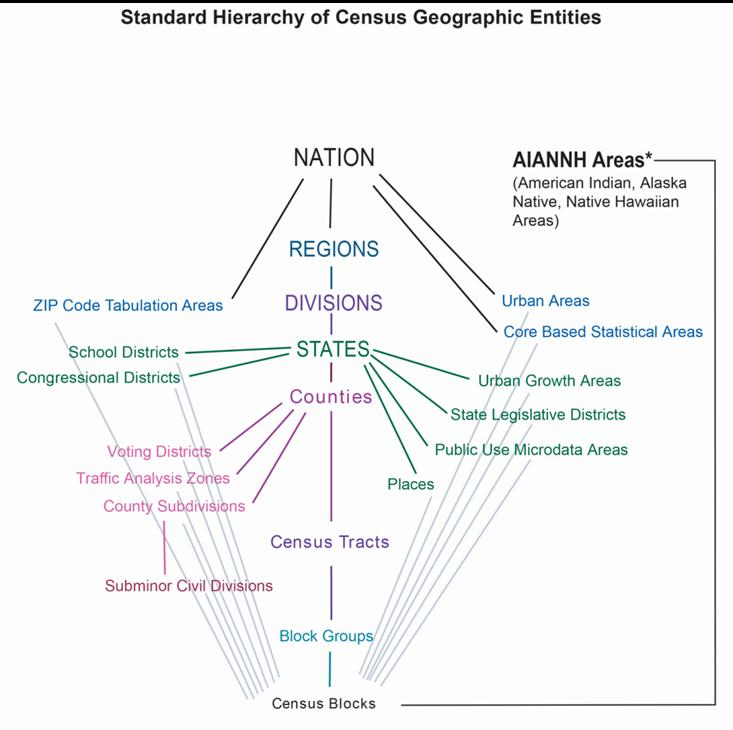
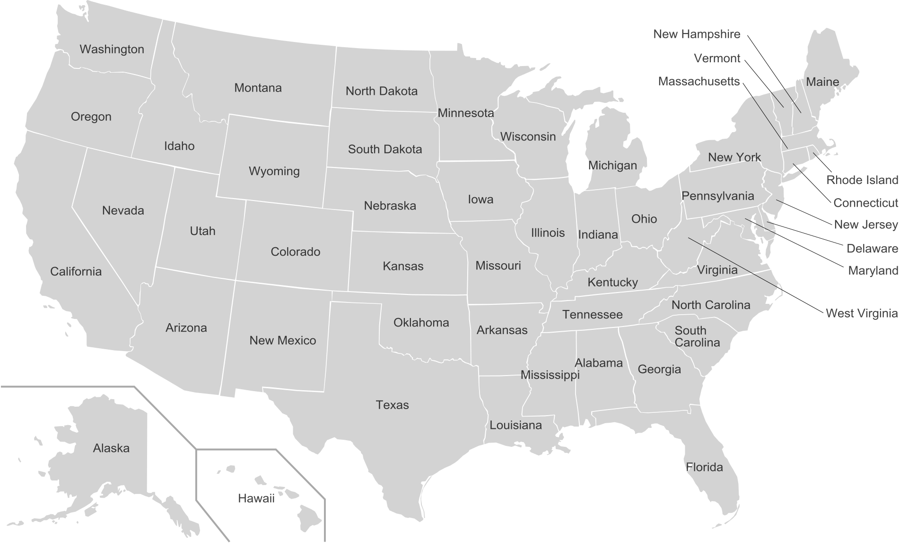

```{r setup, include=FALSE}
knitr::opts_chunk$set(echo = FALSE)
```

## Announcement

* Template for final report on Canvas
* Final report due on 22nd DEC
* For data analysis, please let me know if you cannot make it by this Friday (13th DEC)
* This is the last lecture
* Course evaluation after today's lecture (15 min)

## Why spatial visualization with R?

* **Common solutions: ArcGIS, QGIS**

1. Powerful and professional
2. Good at interactive operation and systematic data management
3. Not good at statistical computing
4. The work is not easy to reproduce

* **R**

1. Many good packages (e.g., sf, ggplot)
2. Powerful statistical learning
3. The work is easy to reproduce
4. Not good at interactive operation

## When spatial visualization with R?

* No access to ArcGIS or QGIS
* Want to combine data analysis and spatial data visualization together in R
* Want the work becomes more reproducible

## Point, Line, and Polygon

{width=90%}

## geometry column

{width=90%}


## Coordinate Reference System (CRS)

{width=100%}

## Coordinate Reference System (CRS)

{width=90%}

## Preparation before start

We need to install the package.

```{r eval=F, echo=TRUE}
install.packages('sf')
```

And import the package.

```{r, echo=TRUE}
library(sf)
```

## Read files

The file format to store the spatial data is **shapefile**. We could import the shapefile with ``st_read()`` function into R.

```{r echo=TRUE}
map <- st_read('Census2010RealignTract.shp')
```

##

```{r echo = TRUE}
head(map, 3)
```

## CRS of spatial data

We could use ``st_crs()`` to check the CRS of the variable.

```{r echo = TRUE}
st_crs(map)
```

Luckily, this spatial dataset contains the right CRS. For the maps in the area of Minnesota, the CRS is the one showing above, 26915 for ``EPSG``.

## Assign CRS to spatial data

However, sometimes, the file does not have CRS information. You have to check the original source of the file and assign the right CRS to it.

```{r echo = TRUE}
st_crs(map) <- 26915
```

By doing this, there is a message telling that this function will not do the transformation for us. Sometimes, even if the file contains the right CRS, its CRS might be different from other files.

**If you want to map several spatial datasets in the same page or want to do geospatial data analysis among them, you have to transfer the CRSs of them to the same one. You could do this by using ``st_transform()``.**

## Simple spatial visualization with ``ggplot2``

We could use ``ggplot2`` to visualize the map. For simply mapping the polygons, we do not need to speficify ``aes()``. And we use ``geom_sf()`` to plot map.

```{r echo=TRUE, fig.width=4, fig.align='center'}
library(ggplot2)
ggplot(map) + geom_sf()
```

## Census system

{width=50%}

## Census system

{width=80%}

## Census system

{width=80%}

## Census system

The map shows all the census tracts in the Twin Cities metro areas.

```{r fig.align='center'}
ggplot(map) + geom_sf()
```

## Deal with R spatial data as a data frame

* Again R spatial data is limilar with data frame except that it has one more column called geometry
* You could use ``dplyr`` to deal with R spatial data as a data frame

```{r echo=TRUE}
class(map)
```

##

```{r message = F, echo=TRUE}
library(dplyr)
new_map <- map %>%
  select(GEOID)
head(new_map, 3)
```

## 

We could join other data to the current geospatial variable by the join functions in ``dplyr``. Firstly, we import the data.

```{r echo=TRUE, message=FALSE}
library(readr)
data <- read_csv('data.csv')
```

| Variable   | Descriptions                                        |
|------------|-----------------------------------------------------|
| GEOID      | Unique identifier used by Census FactFinder website |
| POPTOTAL   | Total population                                    |
| HHTOTAL    | Total households                                    |
| AGEUNDER18 | Population age under 18                             |
| AGE18_39   | Population in this range                            |
| AGE40_64   | Population in this range                            |
| AGE65UP    | Populationage 65+                                   |

## Join the the demographic information to the map

```{r}
data <- data %>%
  mutate(GEOID = factor(GEOID))
```

Then, we do the join operation.

```{r echo=TRUE, warning=FALSE}
new_map <- new_map %>%
  left_join(data, by = 'GEOID')
head(new_map, 2)
```

## Data management

We calculate the percentage of old people in each census tract.

```{r echo=TRUE}
new_map <- new_map %>%
  mutate(old_percent = AGE65UP/POPTOTAL)
head(new_map, 3)
```

## Spatial data visualization

```{r message=F, echo = TRUE}
p <- ggplot(new_map, aes(fill = old_percent)) + # use fill to indicate the variable you want to visualize
  geom_sf()
p
```

## Change the color

The color is not good, we could add ``scale_fill_gradient()`` to specify the colours we want.

```{r echo=TRUE}
p + scale_fill_gradient(low = 'white', high = 'red')
```

## Add title and theme

Again, we could add more information to make the figure better and more readable, and change the theme a little bit.

```{r echo=TRUE, eval = F}
p + scale_fill_gradient(low = 'white', high = 'red') +
  labs(title = 'Distribution of old population in the Twin Cities area',
       fill = 'Percentage') +
  theme_bw()
```

##

```{r fig.width=6, fig.align='center'}
p + scale_fill_gradient(low = 'white', high = 'red') +
  labs(title = 'Distribution of old population in the Twin Cities area',
       fill = 'Percentage') +
  theme_bw()
```

## Save the plot with ggsave()

Finally, we could use ``ggsave()`` to save the plot we want after we run the ``ggplot()`` function.

```{r eval=F, echo=TRUE}
ggsave('fig1.jpg', width = 10, height = 10)
```

## Add other layers in the current plot

```{r echo=TRUE}
transit_route <- st_read('TransitRoutes.shp')
```

## 

```{r echo=TRUE}
ggplot(new_map) +
  geom_sf() +
  geom_sf(data = transit_route)
```

## 

```{r echo=TRUE}
ggplot(new_map) +
  geom_sf(fill = NA, colour = 'Grey') +
  geom_sf(data = transit_route, colour = 'Blue') +
  labs(title = 'Transit route in the Twin Cities Metro area') +
  theme_bw()
```

## Wrap-up for our course

* RStudio and R
* Data management with ``dplyr``
* Data visualization with ``ggplot2``
* Spatial data visualization
* Statistics
* Data exploratory analysis

## Wrap-up for our course

* Nine in-class exercises
* Final project


## Wrap-up for our course

* The notes for this course will keep online
* Any questions are welcomed even the course is over
* Hope the knowledge you learned from this cource will be helpful during your daily tasks


